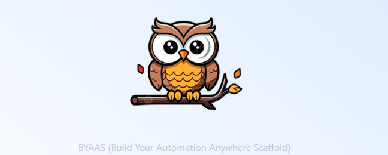

# BYAAS Project

**B**uild **Y**our **A**utomation **A**nywhere **S**caffold - A desktop application for generating best-practice Automation Anywhere scaffold templates.

<p align="center">
  
</p>

## 🚀 Overview

**BYAAS Project** is a cross-platform desktop application built with [Tauri 2.0](https://tauri.app/) and [React 19](https://react.dev/). It automates the generation of best-practice scaffold templates for Automation Anywhere, producing `.zip` files ready to import into your Control Room.

### Key Features

- **Template Generation**: Create Automation Anywhere project templates with customizable phases
- **Phase Management**: Add multiple project phases with automatic folder structure
- **Customer Profiles**: Pre-configured templates for different customers (Keralty, General)
- **Auto-Updater**: Built-in update system with progress notifications
- **Cross-platform**: Windows, macOS, and Linux support
- **Modern UI**: Clean interface with Tailwind CSS and toast notifications

## 📁 Project Structure

```
byaas-project/
├── src/                          # React frontend
│   ├── components/              # Main components
│   │   ├── scaffoldForm.jsx    # Template generation form
│   │   └── splashScreen.jsx    # App splash screen
│   ├── shared/                 # Shared components
│   │   ├── ui/                 # UI components (input, buttons, etc.)
│   │   └── addPhase.jsx        # Phase addition component
│   ├── services/               # Frontend services
│   │   └── updater.js          # Auto-update logic
│   ├── main.jsx               # React entry point
│   ├── App.jsx                # Main application component
│   └── assets/images/         # Static assets
├── src-tauri/                  # Rust backend
│   ├── src/
│   │   ├── commands/           # Tauri command handlers
│   │   ├── domain/             # Domain types and constants
│   │   ├── infra/              # Infrastructure (filesystem, zip, etc.)
│   │   ├── services/           # Business logic
│   │   ├── main.rs            # Application entry point
│   │   └── lib.rs             # Core logic and command registration
│   ├── Cargo.toml            # Rust dependencies
│   └── tauri.conf.json       # Tauri configuration
├── public/                     # Static public assets
├── package.json               # Frontend dependencies
├── vite.config.js             # Vite configuration
└── AGENTS.md                  # Development guidelines
```

## 🛠️ Technology Stack

### Frontend

- **React 19.1.0** - Modern UI framework
- **Vite 7.0.4** - Fast build tool and dev server
- **Tailwind CSS 4.x** - Utility-first CSS framework
- **Sonner 2.x** - Toast notification library
- **@tauri-apps/api 2.x** - Tauri frontend API

### Backend

- **Rust** - Systems programming language
- **Tauri 2.x** - Desktop app framework
- **reqwest** - HTTP client for downloading templates
- **zip** - Archive handling
- **walkdir** - Directory traversal
- **regex** - Pattern matching for template replacement

### Development Tools

- **Bun** - Fast package manager
- **Cargo** - Rust package manager
- **VS Code** - Recommended IDE with Tauri and Rust extensions

## 📋 Prerequisites

Before running this project, ensure you have the following installed:

1. **Bun** - Package manager

   ```bash
   curl -fsSL https://bun.sh/install | bash
   ```

2. **Rust** - Backend development

   ```bash
   curl --proto '=https' --tlsv1.2 -sSf https://sh.rustup.rs | sh
   ```

3. **System Dependencies** - Platform-specific build tools
   - **Ubuntu/Debian**: `sudo apt install libwebkit2gtk-4.0-dev build-essential`
   - **macOS**: Xcode Command Line Tools
   - **Windows**: Microsoft Visual Studio C++ Build Tools

## 🚀 Quick Start

### 1. Clone and Install

```bash
git clone <repository-url>
cd byaas-project
bun install
```

### 2. Development Mode

```bash
bun run tauri dev
```

This starts the development server with hot reload for frontend and backend changes.

### 3. Build for Production

```bash
bun run tauri build
```

Creates optimized desktop binaries for all platforms.

## 📖 Available Commands

### Development

```bash
bun run dev                    # Start Vite dev server (frontend only, port 1420)
bun run tauri dev             # Full Tauri development with hot reload
bun run tauri dev --debug     # Tauri dev with additional logging
```

### Production

```bash
bun run build                  # Build frontend for production
bun run tauri build           # Build complete desktop application
bun run preview               # Preview production build locally
```

### Testing

```bash
# Rust backend tests
cargo test                     # Run all Rust tests
cargo test test_name          # Run single test by name
cargo test module_name::      # Run tests in specific module

# Formatting and linting
cargo fmt                      # Format Rust code
cargo clippy                   # Run Rust linter
```

### Package Management

```bash
bun install                   # Install all dependencies
bun add <package>             # Add new frontend dependency
bun add -d <package>          # Add dev dependency
```

## 🎨 Features

### Template Generation

1. **Enter Project Name**: Specify the name for your Automation Anywhere project
2. **Select Customer**: Choose between predefined customer profiles (Keralty, General Customer)
3. **Add Phases**: Optionally add project phases (e.g., "Phase1", "Phase2")
4. **Generate**: Creates a `.zip` file in your Downloads folder with:
   - Proper folder structure
   - Main taskbot files
   - Environment deployment templates
   - User story templates
   - Configuration files
   - Function templates

### Auto-Updater

The application automatically checks for updates on startup:

- Displays update notifications when available
- Downloads and installs updates with progress tracking
- Auto-restarts after installation

### Example Output

Generated template structure:

```
Automation Anywhere/Bots/
├── {ProjectName}/
│   ├── {Phase}/
│   │   ├── Main_{Phase}
│   │   ├── Historias/
│   │   │   ├── HU00_DespliegueAmbiente
│   │   │   └── HUXX_Plantilla
│   │   ├── Funciones/
│   │   │   └── 00_FuncionPlantilla
│   │   └── Parametros/
│   │       └── Configuracion.xlsx
```

## ⚙️ Configuration

### Tauri Configuration (`src-tauri/tauri.conf.json`)

- **Window Size**: Responsive design
- **Development Port**: 1420 (fixed)
- **Bundle Targets**: All platforms
- **Updater**: Enabled with GitHub releases integration

### Vite Configuration (`vite.config.js`)

- **Port**: 1420 (strict, required by Tauri)
- **HMR Port**: 1421
- **Asset Alias**: `@images` → `src/assets/images`
- **Ignored**: `src-tauri` directory

## 🔧 Development Workflow

### Making Changes

1. **Frontend Changes**: Auto-reload in `bun run tauri dev`
2. **Backend Changes**: Restart dev server after Rust modifications
3. **Testing**: Use browser dev tools for frontend, console for backend

### Code Style

- **Frontend**: Functional React components, Tailwind CSS, Sonner toasts
- **Backend**: Modular architecture with commands, domain, infra, and services layers
- See [AGENTS.md](./AGENTS.md) for detailed coding guidelines

### Debugging

- **Frontend**: Browser developer tools, React DevTools
- **Backend**: Console output and `println!` statements
- **Tauri**: `bun run tauri dev --debug` for verbose logging

## 📚 Documentation

- **[Tauri Documentation](https://tauri.app/develop/)** - Framework guides and API reference
- **[React Documentation](https://react.dev/)** - React features and best practices
- **[Vite Documentation](https://vite.dev/)** - Build tool configuration
- **[AGENTS.md](./AGENTS.md)** - Development guidelines for coding agents

## 🤝 Contributing

1. Fork the repository
2. Create a feature branch (`git checkout -b feature/amazing-feature`)
3. Commit your changes using [better-commits](https://github.com/Everduin94/better-commits) conventions
4. Push to the branch (`git push origin feature/amazing-feature`)
5. Open a Pull Request

## 📄 License

This project is licensed under the MIT License - see the [LICENSE](LICENSE) file for details.

## 🙋‍♂️ Support

- **Issues**: Report bugs via GitHub Issues
- **Questions**: Use GitHub Discussions
- **Community**: Join the [Tauri Discord](https://discord.gg/tauri)

---

## Common Frontend Architecture

````txt
components/
├── ui/              # Componentes base (botones, inputs, etc.)
├── layout/          # Estructura de la app
├── common/          # Componentes reutilizables más complejos
├── feedback/        # Estados visuales (loading, error, empty)
├── forms/           # Componentes relacionados a formularios
├── data-display/    # Mostrar información (tablas, cards, listas)
├── navigation/      # Navegación (menus, sidebar, navbar)
└── modals/          # Modales / diálogos
```

**Built with ❤️ using Tauri + React + Rust**
````
